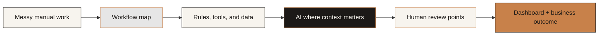

<div align="center">


[](https://git.io/typing-svg)

<br>

[](./garv_arora_resume_updated.pdf)
[](https://linkedin.com/in/garv-arora/)
[](https://github.com/Garv-Arora)
[](https://x.com/industrial_garv)
[](mailto:garv.co.21@gmail.com)


<br><br>


</div>

---

## 🧭 15-Second Profile

I am **Garv Arora**, an aspiring Product Manager building proof around **AI workflows, B2B SaaS systems, GTM automation, document intelligence, and ops-heavy products**.

My bias is simple:

> **Start with the workflow. Make the messy work visible. Then automate the repeated pain.**

| Signal | What it means |
| --- | --- |
| 🏭 **Manufacturing + data base** | Worked at Mondelez across utilities, production shifts, IoT visibility, loss analysis, maintenance cost reduction, and SMED. |
| ⚙️ **SolvX.AI operator context** | Freelance AI agency partner building workflow automations, dashboards, GTM assets, AI audits, and employee trainings. |
| 🚀 **Product direction** | APM / AI PM / Product Strategy roles where customer discovery, product judgment, workflow depth, and technical fluency matter. |
| 📍 **Location** | Bangalore, India |

---

## ⚙️ Workflow Map


```txt
manual work -> workflow map -> system design -> AI where useful -> dashboard -> measured outcome
```



---

## 🚀 Product Proof

<table>
  <tr>
    <td width="33%">
      <h3>🧠 Still</h3>
      <p><b>Trust-first CBT companion</b></p>
      <p>Privacy-first AI product with no-account help, honest AI limits, safety gates, and emotionally careful onboarding.</p>
      <p><b>PM signal:</b> consumer AI trust, safety UX, activation, product judgment.</p>
      <p>
        <a href="https://still-app-delta.vercel.app/">Website</a> |
        <a href="https://drive.google.com/file/d/1Mx9avutRI6UfPVN9s9yfTqWiBHrX4dzH/view?usp=drivesdk">Demo</a> |
        <a href="https://drive.google.com/file/d/1TXGa87ZXLTCsi--fISgrsOO1SGXrnSoY/view?usp=drivesdk">Playbook</a>
      </p>
    </td>
    <td width="33%">
      <h3>🌲 TreeRAG</h3>
      <p><b>Inspectable document intelligence</b></p>
      <p>RAG product built around visible retrieval, cited-or-absent answers, evidence drawers, and evaluation before launch.</p>
      <p><b>PM signal:</b> RAG UX, trust patterns, compliance workflows, eval thinking.</p>
      <p>
        <a href="https://his-commissioner-oct-heights.trycloudflare.com/">Website</a> |
        <a href="https://drive.google.com/file/d/1yjLtAZRbGKj8YlnhQUbcB9deNUGKoYnA/view?usp=drivesdk">Demo</a> |
        <a href="https://drive.google.com/file/d/1Xk6c5OAsLFcpcJNFAuEZRkFwIc1KW29U/view?usp=drivesdk">Playbook</a>
      </p>
    </td>
    <td width="33%">
      <h3>📈 LeadFlow</h3>
      <p><b>Autonomous SDR workflow</b></p>
      <p>Agentic GTM loop where Scout, Enrich, Qualify, Outreach, and Nurture agents turn ICP signals into qualified conversations.</p>
      <p><b>PM signal:</b> B2B workflow design, approvals, metrics, GTM learning loops.</p>
      <p>
        <a href="https://frontend-theta-gold-13.vercel.app/">Website</a> |
        <a href="https://drive.google.com/file/d/1oCs__JRmmQYHGE60sAC9qowaomGxCSzv/view?usp=drivesdk">Demo</a> |
        <a href="https://drive.google.com/file/d/1YSAkTDOq9nowr7sb5-3-0sBFI-BIngLH/view?usp=drivesdk">Playbook</a>
      </p>
    </td>
  </tr>
</table>

---

## 🛠️ Current Work

<table>
  <tr>
    <td width="50%">
      <h3>⚙️ SolvX.AI</h3>
      <p><b>Freelance AI Agency Partner</b></p>
      <p>Building custom AI automations for service businesses and operators drowning in manual follow-ups, reporting, CRM hygiene, and internal workflow gaps.</p>
      <ul>
        <li>Designed the agency brand, website, positioning, offer architecture, and GTM assets.</li>
        <li>Built system maps around capture, enrich, score, route, notify, sync, and report.</li>
        <li>Ran AI audits and employee trainings for B2B local businesses in the US and Australia.</li>
      </ul>
      <p>
        <a href="https://solvx-ai.pages.dev/">Website</a> |
        <a href="https://drive.google.com/file/d/1aXnTguDHDZGZ8oZjQXCqPdV-7CwWdQW8/view?usp=drivesdk">Playbook 1</a> |
        <a href="https://drive.google.com/file/d/14fCzq5k3EUvU23NQyF2i6eyEKE_VJRy6/view?usp=drivesdk">Playbook 2</a>
      </p>
    </td>
    <td width="50%">
      <h3>🎯 Product Direction</h3>
      <p>I use GitHub as a product portfolio, not only a code dump.</p>
      <p>Expect PM case studies, workflow teardowns, AI product notes, PRDs, GTM systems, and experiments that show how I think from problem to shipped proof.</p>
      <p><b>Best-fit roles:</b> APM, Associate PM, AI Product Intern, Product Analyst, Product Strategy, Founder's Office/Product.</p>
    </td>
  </tr>
</table>

---

## 🧱 Product Manager OS

| Layer | How I think |
| --- | --- |
| 🔍 Discovery | JTBD, workflow mapping, pain intensity, customer interviews, user journeys, insight synthesis |
| 🧭 Strategy | ICP, wedge selection, positioning, competitor teardown, market maps, narrative design |
| 📐 Execution | PRDs, MVP scope, acceptance criteria, prioritization, roadmap logic, launch sequencing |
| 📊 Metrics | Activation, retention, funnels, cohorts, North Star metrics, experiment design, instrumentation |
| 🤖 AI Product | RAG, evals, human-in-the-loop review, hallucination risk, confidence UX, source-grounded answers |
| 📣 GTM | Pilot design, pricing hypotheses, sales enablement, landing pages, ROI framing, outbound workflows |
| 🧰 Technical Fluency | Python, APIs, dashboards, automation tools, vector search, LLM orchestration, product prototypes |

---

## 🧰 AI Toolchain

<div align="center">

[](https://skillicons.dev)

</div>

| Layer | Tools I can use, prototype with, or productize around |
| --- | --- |
| 🧠 LLMs | OpenAI, Anthropic Claude, Gemini, Llama, Mistral, DeepSeek, Qwen, Groq, Perplexity |
| 🖥️ Local + edge models | Ollama, LM Studio, llama.cpp, vLLM, ONNX Runtime, TensorFlow Lite, Core ML, OpenVINO, Whisper, Phi, Gemma |
| 🕸️ Orchestration | LangGraph, LangChain, LlamaIndex, CrewAI, AutoGen, OpenAI Agents, n8n, Make, Zapier, Pipedream |
| 🔎 RAG + evals | Pinecone, Chroma, Qdrant, Weaviate, FAISS, Supabase pgvector, LangSmith, RAGAS, Arize Phoenix |
| 📄 Data extraction | Firecrawl, Apify, Tavily, SerpAPI, Unstructured, Docling, BeautifulSoup, Playwright, PyMuPDF, Tesseract OCR |
| 📣 GTM engines | Clay, Apollo, Instantly, Smartlead, Lemlist, Outreach, Salesloft, HubSpot, GoHighLevel, Gmail automation |
| 🧩 Ops systems | Airtable, Notion, Google Workspace, Slack, Linear, Trello, Retool-style internal tools, dashboarding systems |
| 🎬 Creative AI | Higgsfield, Runway, Midjourney, DALL-E, Ideogram, Canva, ElevenLabs, HeyGen, Synthesia |
| 📊 Analytics | GA4, PostHog-style events, Mixpanel-style funnels, cohorts, dashboards, experiment tracking |

---

## 📚 Research Notes I Actually Use

| Paper / idea | Product lesson |
| --- | --- |
| 🧠 Attention Is All You Need | Context is not only a model property. It is a product surface. |
| 🔎 Retrieval-Augmented Generation | Knowledge products need citations, answer boundaries, and evidence paths. |
| 🛠️ ReAct | Agentic systems need visible traces, tool calls, checkpoints, and human override. |
| 🧪 RAGAS / RAG evaluation | AI quality needs faithfulness, relevance, context precision, and regression tests. |
| 🧭 RLHF / Constitutional AI | Good behavior must be defined for the domain, not assumed from the model. |

---

## 📈 GitHub Operating Board

<div align="center">


<br><br>


<br>


</div>

---

## 🏗️ Experience Snapshot

### ⚙️ SolvX.AI

**Freelance AI Agency Partner**

- Building AI workflow systems for lead generation, follow-up, dashboards, and business automation.
- Working with B2B local businesses in the US and Australia alongside an email agency from Bangalore.
- Designed agency branding, website, positioning, GTM, and productized service offers.

### 🏭 Mondelez International

**Production and Data Engineer, Baddi Plant**

- Led productivity work across ETP consolidation, preventive-maintenance restructuring, and repair-cost reduction.
- Helped establish line-level IoT visibility for energy utilization and cost-improvement discovery.
- Managed production shifts, unionized manpower, efficiency-loss analysis, CIL, Centerline, MTBF, and SMED improvement work.

---

## 🧪 Operating Principles

```txt
01. Start with the workflow, not the feature.
02. Find repeated pain, not the loudest request.
03. Ship the smallest before-and-after that creates trust.
04. Measure behavior, not applause.
05. For AI products, show evidence before asking for belief.
06. Do not build a platform until a wedge is earning pull.
```

---

## 📍 Where I Am Headed

I am looking for product roles where AI is not decoration.

I want to work on products where **workflow depth, customer discovery, product judgment, technical fluency, and clean execution** actually matter.

**Interested in:** AI SaaS | workflow automation | legaltech | CLM | B2B SaaS | GTM automation | operations-heavy products

<div align="center">

<br>

[](https://linkedin.com/in/garv-arora/)
[](mailto:garv.co.21@gmail.com)

<br><br>


</div>
